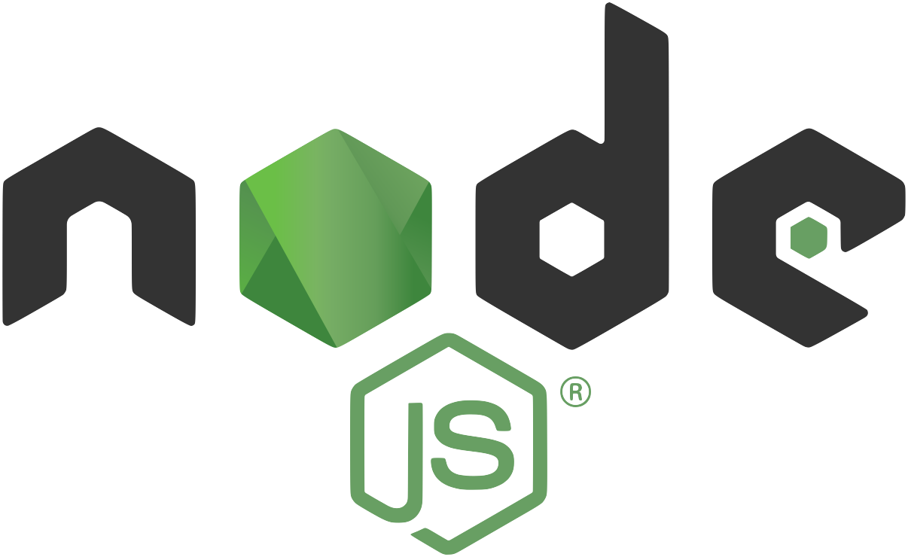

# Employee-Management-System

## Table of Contents
* <a href="#about">About</a>
* <a href="#preview">Preview</a>
* <a href="#user-story">User Story</a>
* <a href="#acceptance-criteria">Acceptance Criteria</a>
* <a href="#installation">Installation</a>
* <a href="#questions">Questions</a>
* <a href="#technologies">Technologies</a>
* <a href="#packages">Packages</a>

## About 
<i><b>Employee Management System</b></i> is a command-line application from scratch to manage a company's employee database, using Node.js, Inquirer, and MySQL.

Developers frequently have to create interfaces that allow non-developers to easily view and interact with information stored in databases, like in this employee management system. These interfaces are called content management systems (CMS). 


## Preview


https://user-images.githubusercontent.com/58195156/138181585-872f293c-3da2-4070-9160-075cc920e89a.mov


## User Story
```
AS A business owner
I WANT to be able to view and manage the departments, roles, and employees in my company
SO THAT I can organize and plan my business
```

## Acceptance Criteria
```
GIVEN a command-line application that accepts user input
WHEN I start the application
THEN I am presented with the following options: view all departments, view all roles, view all employees, add a department, add a role, add an employee, and update an employee role
WHEN I choose to view all departments
THEN I am presented with a formatted table showing department names and department ids
WHEN I choose to view all roles
THEN I am presented with the job title, role id, the department that role belongs to, and the salary for that role
WHEN I choose to view all employees
THEN I am presented with a formatted table showing employee data, including employee ids, first names, last names, job titles, departments, salaries, and managers that the employees report to
WHEN I choose to add a department
THEN I am prompted to enter the name of the department and that department is added to the database
WHEN I choose to add a role
THEN I am prompted to enter the name, salary, and department for the role and that role is added to the database
WHEN I choose to add an employee
THEN I am prompted to enter the employee’s first name, last name, role, and manager, and that employee is added to the database
WHEN I choose to update an employee role
THEN I am prompted to select an employee to update and their new role and this information is updated in the database 
```

## Installation
* On this page, click on the "clone or download" button. At the bottom of the drop down click the "Download Zip" button.

* Open up the "Employee-Management-System" file in a command terminal.

* Use "npm install" to install all required dependencies for the app.
```
npm install
```

* Use "node index.js" in the command line within your terminal to run the application.
```
node server.js
```
## Questions
<a href="https://github.com/CodingNav/"><b>CodingNav</b></a>
<br>
You can reach me with additional questions at: 
<br>
navleenkaurr@gmail.com

# Technologies
&nbsp; &nbsp; &nbsp; 
&nbsp; &nbsp; &nbsp; 


## Packages
* Boxen
* Colors
* Console.table
* Figlet
* Inquirer
* Mysql2
